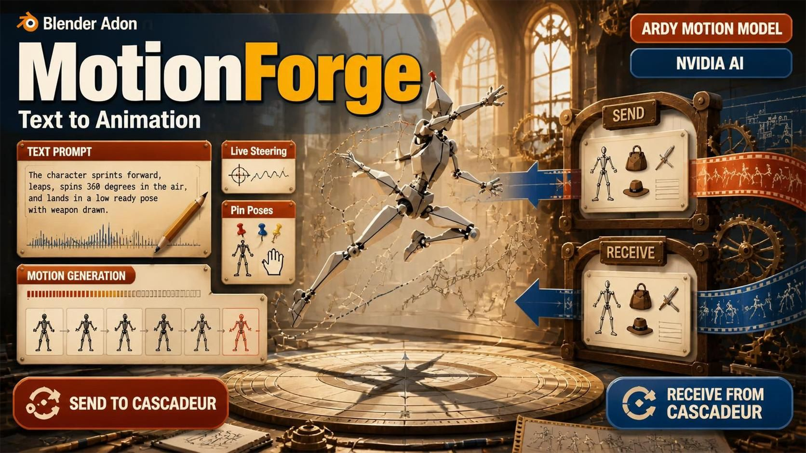

# MotionForge



🇺🇸 English | [🇰🇷 한국어](./KO_index.md)

Type what a character should do. Get an animation in Blender.

MotionForge runs NVIDIA's ARDY motion model next to Blender and keys the result
onto a rig you can edit like any other. You can also steer the character live,
pin poses it has to hit, move the motion onto your own character, and hand it
straight to Cascadeur.

**New in 0.2.0** — *Send to Cascadeur*. A character, or just its animation,
goes over to Cascadeur without an FBX round trip by hand. See
[*Sending it to Cascadeur*](#sending-it-to-cascadeur).

**Also new** — the trip home. **Receive from Cascadeur** brings the work back
onto the rig you sent, at the speed it left or at any other speed you pick.
Rigs built out of several skeletons, such as the Team Fortress 2 Trifecta
rigs, are merged into one on the way over so hats, pouches and weapons arrive
attached, and Cascadeur's Rig Mode is filled in for you. See
[*Bringing it back*](#bringing-it-back).

---

## Setup, once

**1. Install the engine.** Double-click `install.bat`. It makes a `.venv`
folder here and puts everything in it — nothing else on the machine changes.
It needs Python 3.12, Git, an NVIDIA GPU, and about 10 GB of disk.

**2. Install the add-on.** In Blender: `Edit ▸ Preferences ▸ Add-ons ▸ Install`,
pick the `motionforge` folder, tick it on.

**3. Point it at the engine.** Still in the add-on's preferences, set
**ARDY Python** to the `.venv\Scripts\python.exe` that `install.bat` printed
when it finished.

**4. Get access to the text encoder.** ARDY reads your prompt with a Meta
Llama model that requires accepting a licence:

- accept it at `huggingface.co/meta-llama/Meta-Llama-3-8B-Instruct`
- run `huggingface-cli login` in a terminal and paste your token

Press `N` in the 3D viewport and the **MotionForge** tab is there.

---

## The big picture, in 30 seconds

MotionForge is two pieces working together:

- **The engine** — NVIDIA's ARDY model. It turns a sentence into animation frames.
- **The add-on** — this one, running inside Blender. It builds a rig, plays the
  frames on it, lets you steer and pin poses, and copies the result onto your
  own character.

Every animation first lands on a **source rig** that MotionForge builds (the
**Create Rig** button). From there you can copy it onto any *other* armature —
called a **target rig** — so the motion plays on your own character.

---

## The five panels

Press `N` in the 3D viewport and a **MotionForge** tab appears in the right-hand
sidebar. It holds five panels, in the order you will use them.

### 1. MotionForge — connect and make a rig

| Control | What it does |
| --- | --- |
| **Model** | Which ARDY skeleton to use. Keep **Core** — it covers nearly everything. |
| **Text Encoder** | Optional, but strongly recommended (see *The shared text encoder* below). |
| **Connect ARDY** | Loads the engine. The first run downloads several GB; wait for **Ready**. About a minute the first time, then about 5 seconds — it keeps the text encoder loaded between connections. |
| **Create Rig** | Builds an armature — this is your **source rig**, the skeleton the model will animate. |
| **Generated Rigs** list | Every source rig you have made. **Use \<name\>** makes one the active source. |
| **Active source** | The rig that current takes are generated onto. |

### 2. Text to Motion — turn words into animation

| Control | What it does |
| --- | --- |
| **Takes** | Your shots. `+` adds one, `−` removes the selected. |
| — **Source Rig** | Which rig this take fills. Empty = the active source. |
| — **Prompt** | A plain sentence, e.g. *"a person walks forward"*. Start with "a person" — that is how the model was taught. |
| — **Duration** | Length in seconds. |
| — **Seed** | `-1` gives something new each time; a fixed number repeats the same result. |
| — **Continue** | Start from the end of the take *above*, for one continuous performance. |
| **Shared** | Options applying to every take: **Reduce Foot Skating** (cleaner feet and lands exactly on your waypoints/poses — leave it on), **Denoising Steps** (fewer = faster and rougher), **Prompt Strength**, **Constraint Strength**. |
| **Waypoints** | "Be here at this frame" markers that lay out a route. **Face Waypoint Direction** also steers which way the character looks. |
| **Pose Keys** | "Look like this at this frame". Each gets its own editable copy of the rig. |
| **Generate Take / Generate All** | Make the selected take, or every ticked take. |

### 3. Live Path — steer while it plays

| Control | What it does |
| --- | --- |
| **Live takes list** | One row per character in the run. **+** adds a row; each carries its own prompt, rig, seed and target. |
| **Target** | The cone that character walks toward. The **+** beside it makes one. A row with no target just moves as its prompt says. |
| **Start Live / Stop** | Begins or ends live steering, for every row at once. `Esc` also stops it. |
| **Stop After** | Ends the run automatically after this many seconds. `0` runs until you stop it. |
| **Face Target Direction** | Powers the cone's rotation so the character can walk sideways, backwards, or round something while watching it. |
| **Bake / Discard** | Writes the held take as a real Action, or throws it away. |

### 4. Retarget — put the motion on your own character

| Control | What it does |
| --- | --- |
| **Source** | The rig carrying the motion. Usually left as the generated rig. |
| **Target** | *Your* character's armature. |
| **Rig Type** | The naming convention of the target (UE5, Fortnite, Mixamo, Rigify, SMPL-X…). **Auto-Detect** usually gets it right. |
| **Auto-Align Rest Pose** | Swings the target's limbs onto the source's rest pose first, so an A-pose character does not look broken. |
| **Auto Scale Motion** | Scales how far the body travels to fit the target's height. |
| **Match Floor Contact** | Lifts or lowers the target each frame so its feet meet the floor. |
| **Retarget** | Runs the copy. |
| **Share With Characters** | Copies each take onto several characters at once (see below). |

### 5. Send to Cascadeur — hand the motion over

Always visible; it tells you what it needs rather than hiding until the right
thing is selected.

| Control | What it does |
| --- | --- |
| **Send** | **Character and Bones** sends the rig itself — bones, meshes, animation — as a scene Cascadeur opens. **Keyframes Only** puts motion on a character Cascadeur already has. |
| **Rig Type** | Keyframes mode only. Which naming your rig uses, so its bones can be matched to Cascadeur's. Auto-detected; set it by hand if the guess is wrong. |
| **With Mesh** | Character mode only. Include the meshes bound to the rig. |
| **Unify Skeleton** | Character mode only. Sends one skeleton instead of the rig's internal parts, so hats, pouches and weapons arrive attached. Leave it on; your rig is not modified. |
| **Fill Rig Mode** | Fills Cascadeur's Quick Rigging Tool with this rig's joints, so Rig Mode does not have to guess them from their names. |
| **Send Frame Range** | Sends the scene's frame range in one go. |
| **Current Frame** | Sends just the pose you are looking at. |
| **ⓘ** | Asks Cascadeur how many frames it has received. |

See [*Sending it to Cascadeur*](#sending-it-to-cascadeur) for the order these
have to be used in.

---

## Source rig vs. target rig, plainly

- **Source rig** = the armature MotionForge *makes* and animates. You never have
  to rig it; the model already knows its skeleton.
- **Target rig** = any other armature you want the motion on. It can be an
  Unreal Engine mannequin, a Mixamo character, a Rigify rig, an SMPL-X body —
  anything with reasonably named bones that matches one of the presets.

The flow is always the same: **generate on a source → retarget onto a target.**

---

## A beginner's recipe, end to end

1. **Install and connect** (see *Setup, once* above). Wait for **Ready**.
2. **Create Rig** — press it. An armature appears.
3. Add a take with `+`, type what you want, press **Generate Take**.
4. Scrub the timeline to watch it. The rig moves.
5. To put it on your own character: open **Retarget**, pick your character as
   **Target**, choose its **Rig Type**, press **Retarget**.
6. To steer or pin specific moments, add **waypoints** or **pose keys** and
   generate again.

That is the whole loop. Everything else in this guide makes those six steps
better — longer performances, live steering, and copying to many characters.

---

## Words you'll see (glossary)

| Term | Meaning |
| --- | --- |
| **Action** | Blender's name for an animation clip. Each take gets its own Action. |
| **Take** | One shot: its own prompt, its own length, its own Action. |
| **Source rig** | The MotionForge-built armature that holds the generated animation. |
| **Target rig** | Your character's armature that receives the motion. |
| **Retarget** | Copying animation from the source rig onto the target rig. |
| **Waypoint** | "Be at this spot on this frame." |
| **Pose key** | "Look like this on this frame." |
| **Shared encoder** | A text-processing model loaded once and shared, so connecting is fast. |
| **Foot skating** | A foot sliding along the ground when it should stay planted. |

---

## Your first animation

**Connect ARDY.** The first time, this downloads several GB. Wait for *Ready*.

**Create Rig.** An armature appears — this is the skeleton the model animates.

**Press `+`, write what should happen, press Generate Take.**

```
a person walks forward
a person sits down on a chair
a person waves with the right hand
a person jumps over something
```

Plain sentences work best. "a person" is how the model was taught, so start
there. A few seconds later the rig is animated and you can scrub the timeline.

---

## Takes

A take is one shot: its own prompt, its own length, its own Action.

```
☑ a person walks forward       100f ▶
☑ a person sits down            60f ▶
☐ a person waves                 ○
```

- `+` and `−` add and remove takes
- the checkbox decides whether **Generate All** includes it
- `▶` puts that take's animation back on the rig
- `○` means it has not been generated yet

**Generate Take** does the selected one. **Generate All** does every ticked one.

### Chaining takes

Tick the 🔗 on a take and it starts exactly where the take above ended — same
spot, same facing, same pose. Chain several and **Generate All** gives you one
continuous performance built out of separate instructions.

Take 1 has nothing before it, so it cannot be chained.

---

## Steering it

### Waypoints — go through here at this time

Move the 3D cursor, press `+`, set the frame. The character will be at that
spot on that frame. Add more for a route.

Turn on **Face Waypoint Direction** and the empty's green arrow also decides
which way the character looks when it gets there.

### Pose keys — look like this on this frame

Go to the frame you want, press `+`, then pose.

Each key gets **its own rig** — a copy of the generated one named `cskel27_001`,
`cskel27_002`, and so on — and `+` drops you straight into pose mode on it.
Pose that copy, not the animated rig. It carries no animation of its own, so
what you pose stays put no matter how much you scrub.

Add as many as you like: frame 30, frame 60, frame 100. Press **Generate** and
the take is made to pass through all of them in order — A to B to C.

- **Whole Body** holds every joint. That frame comes out looking like what you
  posed.
- **Parts** holds only the hands and feet you tick, and lets the model invent
  the rest of the body around them.

Mix them freely: pin the first frame exactly, and only a hand later on.

**IK On** puts hand and foot handles on the selected key's rig so you can pose
it by dragging instead of rotating 27 bones:

- Blue cubes on the hands and feet — drag one and the limb follows.
- Yellow pyramids at the elbows and knees — these are pole targets. Move one to
  say which way the joint bends.
- **IK Off** bakes what IK is showing onto the bones and removes the handles.
  The pose stays exactly as it looked.

Turning IK on never moves the pose: the handles are built where the limbs
already stand, and each pole angle is measured from the bend the pose already
has. If a limb jumps when IK comes on, that is a bug, not you.

The poses are read when you press Generate, not when you press `+`. So adjust
a pose and Generate again — no need to re-add the key. **Pose \<name\>** in the
panel jumps back to a key's frame and selects its rig for editing; removing a
key deletes its rig with it.

Moving a pose rig moves where the character will be on that frame, since the
root position is part of the pose. Leave it where it is unless you mean that.

> **Keep "Reduce Foot Skating" on.** It is also the step that lands the motion
> exactly on your waypoints and pose keys. With it off they become suggestions.

---

## Live Path — steer while it plays

This is the fun one.

1. Open **Live Path** and press **+**. A row appears — give it a prompt and
   pick the rig it drives.
2. Press **+** beside **Target**. A cone appears — its point is the direction
   the character will face.
3. Press **Start Live**. The character begins moving.
4. **Drag the cone.** The character walks toward it.

Press `Esc` or **Stop** to end it. Nothing is keyed until you **Bake**.

**Animate the cone instead of dragging it.** Keyframe it, parent it to a
curve, drive it however you like — MotionForge just reads where it is each
time it needs more motion. That gives you a repeatable path you can re-run with
different prompts or seeds, and exact control over timing.

Tick **Face Target Direction** and the cone's rotation steers facing too, so
the character can walk backwards, sidestep, or circle something while watching
it.

**Several characters at once.** Add a row per character and press **Start
Live** once. Each walks to its own cone, on its own prompt. They can stand
anywhere and face any direction — a target is read from where that rig stands,
not in world coordinates.

**Stop After** ends the run on its own after a set number of seconds. Leave it
at `0` and it runs until you stop it; there is no hidden limit, and the room
ahead grows as the take does.

**What to expect**

- Steering shows up about 2 seconds later. What you are watching was already
  decided. The **Core, short horizon** model reacts in 0.4 s instead, at some
  cost in quality.
- Keep the cone roughly a walk ahead of the character. Put it too far and the
  character breaks into a run; jerk it around and the footwork gets messy.
- Live skips the foot-skating pass. If a live path is exactly what you wanted,
  rebuild it with waypoints for the cleaner result.

**If it cannot keep up**, the panel says where the time goes:

```
12.4s generated, 1.8s ahead
gen 130 + hold 0 of 2000 ms
```

The last number is how long one window plays for. As long as the first two add
up to less than it, the loop is keeping ahead.

- **gen** is generation. On an RTX 5080 one character costs about 130 ms and
  four cost about 490 ms, because the characters are generated one after
  another. If **gen** is in the thousands, the text encoder is sitting on your
  graphics card — see *Why the text encoder runs on the CPU* below.
- **hold** is what it costs to keep the window in memory, which is nothing.

MotionForge generates further ahead when a cycle takes longer, so adding
characters does not make it stutter. It only asks for more room when it needs
it, because running further ahead makes dragging the cone slower to show up.

### Bake

Live never writes keys as it runs. Keying redraws the viewport for every frame
of every window - 658 ms of a 2000 ms budget in a real editor - so the take is
held in memory instead and the loop stays clear.

When you stop, the panel says how many seconds are waiting and a **Bake**
button writes the whole take in one go. It is there whenever something is
waiting, so you can generate as long as you like and decide afterwards; the
rig does not move until you press it. **Discard** throws the take away.

---

## Roadmap: SMPL-X bodies

MotionForge makes motion but has no body. [SMPL-X][smplx] is the opposite — a
parametric human body (10 shape numbers, 55 joints) with the deformation
research behind it. Meshcapade's [Blender add-on][mc] builds one in Blender,
and Perceiving Systems' [Unreal plugin][ps] computes its pose-corrective blend
shapes *at runtime* instead of baking them per frame. That last part is what
makes it a fit: it means generated and streamed motion works as well as
recorded motion, with no bake step.

Four steps, in the order they are being built:

| # | Step | State |
| --- | --- | --- |
| 1 | **Retarget onto SMPL-X / SMPL-H** — pick the body in the Retarget panel like any other rig | **done** |
| 2 | **Export `.smpl` / `.npz`** — the pose parameters themselves, for AMASS, BEDLAM and Meshcapade tooling | **done** |
| 3 | **Live Link to Unreal** — stream a take into UE while it generates, correctives computed live | **stream verified in UE** |
| 4 | **Shape-aware retargeting** — the motion is corrected for the body's build | **done** |

The order is deliberate. Step 1 reuses the retarget engine that already works
on UE5, Fortnite, Mixamo and Rigify, so it is the least new machinery for the
most result, and it is the thing the other three stand on. Step 2 is a small
writer once step 1 defines the joint mapping. Step 3 is the one worth having —
steering a photoreal character in Unreal from a text prompt, with nothing
baked — but it needs 1 and 2 first.

### Step 3: the motion stream

Turn on **Stream to Unreal** in Live Path and each window is pushed over TCP
as it is generated, to anything listening on the port. One JSON object per
line, so a receiver is a socket and `json.loads`:

```
{"type":"hello","protocol":1,"skeleton":"cskel27",
 "joints":["Hips",...],"parents":[null,0,...],
 "rest":[[x,y,z],...],"fps":20.0,"up":"y"}

{"type":"frame","index":0,"time":0.0,
 "translation":[x,y,z],"pose":[[rx,ry,rz],...]}
```

`pose` is one axis-angle rotation per joint relative to the rest pose, in the
order `joints` gives — enough to run forward kinematics. Y is up. A late
joiner gets the hello and then whatever comes next; a listener that leaves is
dropped without disturbing the generation.

Verified end to end: 120 frames of a live take, in order, and running the
kinematics from the stream puts every joint within 2 µm of where the rig is
standing in Blender.

### The Unreal plugin

`MotionForgeLiveLink` lives in the MetaHuman_FAB58 project's `Plugins` folder.
It adds **MotionForge** to Live Link's *Add Source* list: give it
`127.0.0.1:9560`, and the take appears as an animation subject while Blender
is still generating it.

It converts on the way in — metres to centimetres, Y-up right-handed to Z-up
left-handed — and publishes bones parent-relative, which is what Live Link
expects. It reconnects on its own, so the order you start Blender and Unreal in
does not matter.

From there: a **Live Link Pose** node in an Anim Blueprint, then the SMPL
plugin's **SMPL Pose Correctives** node after it. The correctives are computed
from whatever pose arrives, so a generated take deforms the body exactly as a
recorded one would.

The stream carries ARDY's own joint names (`Hips`, `Spine`, `LeftUpLeg`…), not
SMPL-X's. Use a Live Link Remap Asset if your target skeleton names differ.

**Verified in Unreal**, on UE 5.8:

```
LogMotionForge: Subject published: skeleton 'cskel27', 27 joints, 20.0 fps.
LogMotionForge: First frame pushed to Live Link.
```

A subject reading *Subject Invalid* before the first frame is normal - the
skeleton arrives first and the subject only becomes valid once frames follow.
It goes back to invalid when a take ends, for the same reason.

#### The skeleton to receive on

Live Link does not create anything in Unreal - it drives a Skeletal Mesh that
is already there. So you need a skeleton, and its bones have to match what the
stream sends.

**Export Rig for Unreal (FBX)**, next to the stream settings, writes one built
for the job. Import it in Unreal and it lines up with no remapping at all.

It is not the rig you see in Blender. Live Link writes each streamed transform
straight into a bone's local slot, so the receiving skeleton has to share
ARDY's convention: every joint's rest orientation is the identity. The Blender
rig aims each bone at its child to be readable, which is up to 128 degrees away
from that - every rotation would land twisted by the difference. The exported
one has every bone pointing the same way. It looks like a bundle of sticks, and
that is the point: it is a driver.

From there, Unreal's **IK Retargeter** moves the motion onto the character you
actually want - a MetaHuman, an SMPL-X body - which is the same route BEDLAM
uses.

#### Wiring it up

1. Import the FBX. Unreal makes a Skeletal Mesh and a Skeleton.
2. Right-click the Skeleton, Create Animation Blueprint.
3. In the AnimGraph: **Live Link Pose** (Subject: `MotionForge`) into
   **Output Pose**. Add the SMPL plugin's **SMPL Pose Correctives** node
   between them when you are driving an SMPL body.
4. Drop the mesh in the level and set its Anim Class to that Blueprint.

**Nothing has watched a character move yet.** The stream reaches Live Link and
the skeleton is built to match it, but how the motion looks in Unreal is not
confirmed.

### Step 4: standing on the same floor

ARDY generates on one fixed skeleton. Retargeting already scaled the stride to
the target's legs, but nothing put its feet on the ground, so a body built
taller or shorter hovered above the floor or sank into it.

**Match Floor Contact** in the Retarget panel fixes that. Each frame, the
target is raised or lowered so its lowest joint sits where the source's does,
scaled to its own build. A planted foot lands on the floor; a jump is still a
jump.

Measured on bodies built at 0.7x and 1.4x: a planted foot went from 45 mm off
the floor to 0.0 mm, with nothing sinking through, and the take kept both its
travel and its rise and fall.

True shape-*conditioned generation* — the body's build changing how the model
moves in the first place — would need ARDY retrained with shape as an input,
which is not something this add-on can do. What is achievable, and what this
is, is making the motion correct **for** the body it lands on.

**What you need.** SMPL-X model files are licensed separately: free for
academic use from the [project page][smplx], commercial through
[Meshcapade][mc-lic]. They cannot ship with this add-on.

**What will not work yet.** SMPL-X wants 30 finger joints. The released ARDY
model has one thumb joint per hand, so hands stay in their neutral pose. The
77-joint SOMA skeleton has full fingers, but NVIDIA has not published it.

[smplx]: https://smpl-x.is.tue.mpg.de/
[mc]: https://github.com/Meshcapade/SMPL_blender_addon
[mc-lic]: https://meshcapade.com/
[ps]: https://github.com/PerceivingSystems/smpl-unreal

---

## One take, several characters

Set the characters up **before** you generate, and every take lands on all of
them at once.

In the retarget panel, under **Share With Characters**: select a character,
press `+`, pick its rig type if Auto guesses wrong. Add two or three. From then
on, Generate — and Bake, after a live take — copies the motion onto every one.

- **Fill Characters After Generating** — untick to stop it happening
  automatically.
- **Fill Characters** — do it now, for a take that is already made.
- The tick box beside each character skips it without removing it.

**Why not during a live take?** Because it does not fit. A retarget costs about
55 ms a frame per character, measured: one character needs 2197 ms for a
40-frame window, two 4598 ms, three 6787 ms — and a live window has 2000 ms to
be ready in. So the copy happens once a take exists, which is also when it can
be done in one pass instead of forty.

---

## Moving it onto your own character

Open **Retarget**, pick your armature under Target, choose its family
(UE5, Fortnite, MetaHuman, Mixamo, Rigify, TF2 Trifecta, SMPL-X…) and press
Retarget. **Auto-Detect** usually gets it right on its own.

Verified on Unreal Engine 5 mannequins, Fortnite exports, Mixamo rigs, Rigify
and SMPL-X bodies, and on the Scout, Soldier, Heavy, Medic, Sniper and Spy in
both their Legacy and New Trifecta rigs — including rigs built at centimetre
scale.

**SMPL-X / SMPL-H.** Build a body with Meshcapade's Blender add-on, pick it as
the Target, and generate. Fingers stay in their neutral pose — the released
ARDY model has one thumb joint per hand and nothing else.

Once the motion is on an SMPL body, **Export SMPL (.smpl)** appears under the
Retarget button. That file is the pose parameters themselves rather than a
baked skeleton, so it opens in AMASS, BEDLAM and Meshcapade's tools, and it is
what Perceiving Systems' Unreal plugin wants. Body shape is read from the
body's own shape keys if the Meshcapade add-on left them there.

---

## Sending it to Cascadeur

Motion made here can go straight onto a character in Cascadeur. No FBX to
export by hand, no import dialog.

**Turn Cascadeur's side on first.** In Cascadeur: `Animation Scripts` →
**Receive Poses (Blender)**. It starts listening on `127.0.0.1:9564`; running
it again stops it. This needs the Cascadeur plug-in installed.

### The order matters

1. **Send Character** — sends this rig, its meshes and its animation. Cascadeur
   opens it in a tab of its own.
2. **Send Frame Range** (Keyframes Only) — sends new motion onto the character
   that is now there.

Do it the other way round and the keyframes have nothing to land on.

**Send Character again after restarting Cascadeur.** When the character
arrives, Cascadeur records the orientation every joint came in at, and the
keyframes are measured against that record. Restarting Cascadeur loses it, and
keyframes sent afterwards will be turned the wrong way — quietly, with nothing
reporting an error.

### Sending onto Cascadeur's own character

You do not have to send a character first. If Cascadeur already has one of its
own open, switch to **Keyframes Only** and send: bones are matched by role, so
a UE5, Mixamo, Rigify or SMPL-X rig is translated into Cascadeur's own joint
names on the way across — `pelvis` lands on `Hips`, `upperarm_l` on `LeftArm`.

### What actually crosses

**A turn, not an orientation.** Each bone's rotation goes over measured from
its own rest pose, and Cascadeur folds its character's rest back in. Sending
the world orientation instead only works when both skeletons happen to rest the
same way, which they never do — Blender lays a bone's Y down its length, and
Cascadeur's joints rest however the character was built.

**Joint positions only when it is the same skeleton.** Onto a different
character only the root's position is sent and the rotations carry the pose,
so Cascadeur keeps its own bone lengths. Sending every joint's position drags
that character's bones to *this* rig's proportions, and the mesh — still bound
to the bones it was skinned to — breaks at the elbows and knees.

Measured, onto a character sent from here: joint positions match to
**0.0000 cm** and rotations to **0.000003**. Onto a different character the
pose is fitted rather than copied, and the character keeps its own proportions.

### Speed

A range crosses in one write. Forty frames of twenty-seven joints land in
0.09 s, so there is nothing to gain from sending frame by frame — a write
costs about the same whether it carries one pose or a thousand.

### Rigs built out of several skeletons

Some rigs are not one skeleton. A Rigify-built character — the Team Fortress 2
Trifecta rigs are the ones you are most likely to meet — keeps the bones that
move the mesh apart from the bones the hat, the pouch and the weapon hang off.
Sent as they are, the character arrives in Cascadeur in pieces: the body moves
and the props stay where they were.

**Unify Skeleton** merges them into one before the character crosses. Leave it
on. Your rig is not touched — the copy is made, sent and thrown away.

* The hat stays on the head, the pouch on the belt, the weapon in the hand.
* Fingers, toes and twist bones follow the limb they belong to.
* Both Trifecta rigs are recognised on sight, and so are their fingers.

### Filling Cascadeur's Rig Mode

Cascadeur's Quick Rigging Tool guesses which joint is which from their names,
and a character whose bones are not named the way it expects gets almost
nothing — a TF2 mercenary filled three fields out of twenty-one.

**Fill Rig Mode** hands it the answer instead. It runs on its own with
Send Character, and there is a button to do it again later.

Open the Quick Rigging Tool afterwards and look the joints over before you
build the rig. Cascadeur keeps the fields it has and quietly drops the rest;
anything it drops still follows the joint above it.

---

## Bringing it back

**Receive from Cascadeur** brings the work home. Pick the armature to receive
onto first.

**Animation Only** keys onto the rig you already have. **Mesh + Animation**
brings the character back as new objects.

On a rig that needed **Unify Skeleton** to get there, the animation lands on
the controls you normally animate with, not on the deform bones.

### Timing

Cascadeur runs on its own frame rate, which is usually not the one this scene
is set to. The same motion can come back as a different number of frames.

| Timing | What you get |
| --- | --- |
| **Match Timing** | It comes back at the speed it left, whatever Cascadeur is set to. |
| **Fit Scene Range** | Spread across this scene's frame range. Ten frames into two hundred and fifty is slow motion, and that is the point. |
| **One For One** | One Cascadeur frame becomes one Blender frame, untouched. |

Match Timing needs a Send Character from here to compare against; without one
the take lands at Cascadeur's own frame count and says so.

Setting both programs to the same frame rate is exact. Anything else is
interpolated, which is close but not the same thing.

---

## Settings worth knowing

| Setting | What it does |
| --- | --- |
| **Seed** | `-1` gives something new each time. Fix it to get the same motion back. |
| **Duration** | How long this take runs. |
| **Reduce Foot Skating** | Cleans up sliding feet **and** enforces waypoints and pose keys. Leave it on. |
| **Denoising Steps** | `0` uses the model's default. Fewer is faster and rougher. |
| **Prompt Strength** | How hard it tries to obey your words. |
| **Constraint Strength** | How hard it tries to hit your waypoints and poses. |

### Models

| Model | Use it for |
| --- | --- |
| **Core (27 joints)** | Everything. This is the default. |
| **Core, short horizon** | Live steering when you want faster reactions. |
| **Unitree G1** | The humanoid robot. Adds a MuJoCo `qpos` CSV export. |
| **SOMA** | Not released by NVIDIA yet. Connecting with it fails. |

### Where the model weights live

About 19 GB in total — 15 GB of it the text encoder, the rest the motion
models. They are downloaded the first time you connect and kept forever after.

**Checkpoints** in the add-on preferences decides where. Set it and everything
is downloaded and read there. Leave it empty and Hugging Face keeps them in
your user profile, under `C:\Users\<you>\.cache\huggingface`.

Worth setting if your C: drive is tight, or if you want the weights beside the
project rather than hidden in a profile folder. Changing it later does not
move what has already been downloaded — copy the `models--*` folders across
yourself, or the next connect fetches 19 GB again.

### The shared text encoder

Reading your prompt needs a 14 GB language model. It is loaded once and kept in
a process of its own, so connecting takes about 5 seconds — including when you
switch models or reconnect. **Connect** starts it for you the first time.
Leave it running while you work; **Stop** in the same box frees the memory.

It serves Blender only. The browser demo speaks a different protocol and always
loads its own copy.

#### Why the text encoder runs on the CPU

Two models are involved, and they want very different things.

| | What it does | How often |
| --- | --- | --- |
| **Text encoder**, 14 GB | Turns your prompt into numbers | Once, when a take starts |
| **Motion model**, ~1 GB | Generates the actual movement | Every window, all run long |

The motion model has to be on the graphics card — that is what makes a window
take 130 ms instead of seconds. The text encoder does not: it runs once per
take, and a second on the CPU costs you nothing you can feel.

On a 16 GB card they do not both fit. Putting the 14 GB encoder there leaves
the motion model without room, and it starts spilling — shuffling data on and
off the card to keep working. Nothing fails, everything just crawls. Measured
on an RTX 5080:

| One window | Encoder on the card | Encoder on the CPU |
| --- | --- | --- |
| One character | 2059 ms | **131 ms** |
| One character, following a target | 8084 ms | **140 ms** |
| Four characters | 36829 ms | **490 ms** |

A window plays for 2000 ms, so the left column cannot keep up with playback at
all. That is the difference between live steering working and not.

**Text Encoder On** lets you choose:

| | |
| --- | --- |
| **Auto** | Measures your card. Under 20 GB, the encoder goes on the CPU. This is the default and it is right for almost everyone. |
| **CPU** | Always on the CPU. |
| **GPU** | Always on the card. Sensible on 24 GB and up, where both fit. Slightly faster prompt reading — 0.8 s instead of 1.6 s, once per take. |

On the CPU the encoder never touches your graphics card at all, not even while
loading, so you can have Unreal or a second Blender open while it starts.

---

## In a browser instead

`start_web.bat` opens NVIDIA's own interactive demo at
`http://localhost:2333`. It is a different way to work — a timeline of prompts
you scrub through, with no Blender involved.

Run one at a time. The demo loads its own copy of the 14 GB text encoder, which
on a 16 GB card leaves nothing for anything else. Disconnect in Blender, and
stop the shared encoder, before starting it — otherwise the demo runs out of
memory while loading and closes.

`start_web.bat` launches it with four things fixed. None of them edit `ardy/`,
so updates to NVIDIA's code still apply cleanly.

**The timeline bar can be moved.** Two things were in the way. The demo
re-ranged the bar to a 20-frame trailing window on *every* frame change —
twenty times a second — which snapped the view back to the playhead and undid
any scrolling as fast as you did it. And the left mouse button is spoken for:
on the header it scrubs the playhead, on a track it makes keyframes, so
click-dragging the view just moved the frame instead.

| Gesture | What it does |
| --- | --- |
| **Middle-button drag** | Move along the take |
| Wheel | Move along the take |
| Shift + wheel | Zoom |
| Left drag on the header | Scrub the playhead |

Middle-button drag is added by patching viser's own web client, which lives in
the virtual environment rather than in anything we ship. `install.bat` applies
it and rebuilds. To undo it:

```bash
.venv\Scripts\python.exe motionforge\patch_timeline.py --revert
```

**Text tab** — the whole take is built here, beside the prompt it is made
from. Making motion and watching it are separate, as they are in Blender.

- **Prompt** and **Ends at Frame** — what the character does, and the frame it
  runs to. The next prompt starts on the frame after.
- **Add to Take** — queue it. Add as many as you like; they are generated one
  after another, the way takes chain in Blender. The list shows the frame
  range each one covers.
- **Generate** — make the queued prompts in order, then stop. Nothing plays;
  the playhead returns to the first frame when it is done. With an empty list
  it just uses the Prompt box.
- **Examples** — the stock demo's preset prompts, which it called "Prompt
  List" even though pressing one replaced the prompt and regenerated on the
  spot. Here they only fill the Prompt box.
- **Use This Prompt From Here** — change the prompt at the playhead without
  queueing anything, for steering a take by hand.

Boundaries land on the frame you asked for. Queue *walks* to 30, *runs* to 100
and *stops* to 200 and the take is 201 frames, changing on 31 and 101 — not on
whatever multiple of the generation window came nearest.

Generate only makes what is missing: add a fourth prompt and the first three
are left alone, edit the second and everything from it onward is rebuilt.
- **New Motion** — empty the take and go back to frame 0. It generates
  nothing: the point is to start over, so add your prompts and press Generate.
- **Clear Take List** — empty the queue, leaving the take alone.

**Playback tab** only plays:

- **Play** — replay what has been generated. It does not generate anything.
- **Loop Playback** — start again at the first frame instead of stopping.
- **Keep Generating While Playing** — off. The stock demo has this on with no
  way to turn it off, which is why Play there generates forever and you can
  never simply watch what you have. Tick it if you want that back.

So the usual round is: **New Motion**, add two or three prompts, **Generate**,
**Play** to look at it, **Export BVH** to keep it.

Under Frame Index:

- **First Frame** / **Last Frame**
- **Start Frame**, **End Frame**, **Apply Range** — set exactly what the bar
  shows
- **Visible Frames** — zoom. Smaller is zoomed in
- **Fit Whole Take** — put everything back on the bar

The Frame Index box also accepts any frame; the stock one stops at 199 however
long the take is.

**Files tab**:

- **Choose Mesh** — a real file picker, reading from *your* computer. The IO
  tab's "Load 3D Mesh" only takes a path on the machine running the server.
  Set **Scale** first, or change it and press **Apply Scale / Transform** to
  reload the same file without picking it again. A room modelled in
  centimetres needs 0.01 to sit right beside a character in metres.
- **Export BVH** — the skeleton and its animation, in a file Blender, Maya,
  MotionBuilder and Unreal all import. Scale 1.0 writes metres; 100 for tools
  that expect centimetres, 0.01 for a rig that arrives far too big.

There is no FBX export. FBX needs Autodesk's SDK, which is not part of this
install and cannot be redistributed with it. Import the BVH into Blender and
export FBX from there — or generate in Blender to begin with, where the rig is
already native.

**Restart** — clearing the motion without reloading the page — already exists,
under the Generate tab.

---

## When something is wrong

**"ARDY is still loading the model"** — the engine starts before it is ready.
Wait for *Ready*.

**"This bridge was started without a text encoder"** — Skip Text Encoder is
ticked. Untick it and reconnect.

**Connecting fails right away** — check that **ARDY Python** in the add-on
preferences points at a real `.venv\Scripts\python.exe`.

**The character walks on the spot** — that is the model, not a bug. Some seeds
produce a walk that barely travels. Change the seed, or ask for something with
more intent: *"a person runs forward quickly"*.

**Pose keys seem ignored** — make sure **Reduce Foot Skating** is on. Note that
the G1 robot skips that pass entirely, so poses only guide it there.

**The retarget looks broken** — check the family under Target matches the rig
you picked.

**"Cascadeur is not listening on 127.0.0.1:9564"** — its side is off. In
Cascadeur: `Animation Scripts` → **Receive Poses (Blender)**.

**Keyframes arrive but the character is turned the wrong way** — Cascadeur was
restarted after the character was sent. It only knows how to place the motion
if it still holds the record it made when the character arrived. Press **Send
Character** again, then send the keyframes.

**Keyframes go nowhere and nothing says why** — the joint names sent do not
match anything Cascadeur has open. Check the line above the buttons: it says
how many bones were matched and under which naming.

**Limbs bend oddly on Cascadeur's own character** — expected to a degree.
Cascadeur keeps its character's bone lengths, so a rig with different
proportions is fitted rather than copied.

**Live stutters, or one window takes seconds** — read the second line of the
Live panel, `gen X + hold Y of 2000 ms`. If **gen** is in the thousands, the
text encoder is on your graphics card crowding out the motion model; set
**Text Encoder On** to *Auto* or *CPU* and reconnect. See *Why the text
encoder runs on the CPU*.

**The panel says Connecting and the button is greyed out** — a session that
was closed mid-connect. Opening a file clears it; so does re-enabling the
add-on.

**Characters ignore their targets and walk off on their own headings** — fixed.
If you see it, the add-on is an older copy.

**Windows warns about low memory, or Python crashes while connecting** — two
copies of the 14 GB text encoder are loaded at once. Only one is ever needed:
press **Stop** under the text encoder, close any other Blender running
MotionForge, and connect again.

For anything else, Blender's system console (`Window ▸ Toggle System Console`)
carries the engine's own messages.
